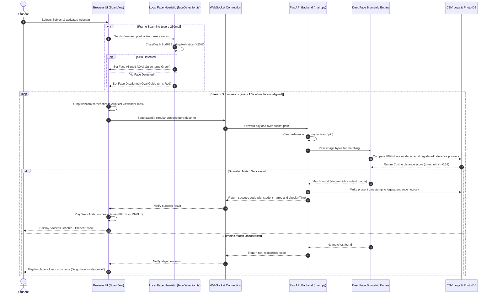

# Smart Attendance Portal 🎓✨

A contactless, real-time biometric student attendance monitoring system. This project uses high-precision facial recognition to verify student identity, record daily check-ins, and track attendance streaks.

---

## 🚀 Key Features

* **Contactless Facial Recognition**: Fast biometric verification using a device camera.
* **Client-Side Face Detection**: Runs a skin-pixel heuristic filter locally to determine face alignment before polling the server, saving network bandwidth.
* **WebSocket Integration**: Feeds video frame data to the backend in real-time for instantaneous responses.
* **Dynamic Cutoff & Absentee Tracker**: Evaluates daily logs against custom time parameters to flag late/absent students.
* **Streak & Achievement System**: Calculates consecutive check-in streak histories and awards gamified badges ("Early Bird", "Perfect Week", etc.).
* **Admin Dashboard**: Inspect historical logs, manage student profile directories, deregister students, and export records as Excel-compatible CSV sheets.

---

## 🛠️ Tech Stack

* **Frontend**: Next.js 14 (App Router), TypeScript, Tailwind CSS v4, React Webcam, Vitest.
* **Backend**: FastAPI, DeepFace (VGG-Face model), OpenCV (Haar Cascades), WebSockets, Pandas.

---

## 📦 Quick Start & Installation

Detailed step-by-step setup guides can be found in the [INSTRUCTIONS.md](./INSTRUCTIONS.md) file.

### 1. Backend Setup (FastAPI)
```bash
cd backend
python -m venv .venv
# Activate virtual environment
# Windows (PowerShell): .venv\Scripts\Activate.ps1
# macOS/Linux: source .venv/bin/activate

pip install -r requirements.txt
uvicorn main:app --reload --port 5000
```
The backend server runs on `http://localhost:5000`.

### 2. Frontend Setup (Next.js)
```bash
cd frontend
npm install
npm run dev
```
The portal opens on `http://localhost:3000`.

---

## 🗺️ System Architecture

This diagram shows how the frontend browser client, local browser heuristics, and backend FastAPI machine learning services are organized:

```mermaid
graph TD
    subgraph Frontend Client (Next.js & React)
        Portal[Attendance Portal Root]
        FSM[FSM Hook: useAttendanceFSM.ts]
        Home[Home Dashboard View]
        Scan[Camera Scan Overlay]
        Heuristic[Skin-Color Face Alignment Heuristic]
        Audio[Audio Synth: Chimes]
    end

    subgraph Backend Server (FastAPI)
        API[FastAPI Endpoint Routes]
        Matcher[DeepFace VGG-Face Matcher]
        DB_Images[(Student Photos Directory)]
        CSV_Logs[(attendance_log.csv)]
    end

    %% Routing Flow
    Portal --> FSM
    FSM -->|1. Select Subject & Go| Home
    FSM -->|2. Align & Stream| Scan
    Scan -->|Webcam Video Frames| Heuristic
    Heuristic -->|Skin Detected: Green Guide| Scan
    
    %% Communication & Backend
    Scan <-->|WebSocket Stream / REST API| API
    API -->|Biometric Lookup| Matcher
    Matcher <-->|Check Matches| DB_Images
    Matcher -->|Success match found| CSV_Logs
    
    %% Response Flow
    API -->|Match Status Result| Scan
    Scan -->|If Present: Trigger Chime| Audio
```

---

## 🔄 Data Flow Sequence

The sequence diagram below traces the check-in data cycle from raw camera scan to verified log persistence:



---

## 📁 Repository Directory Structure

```
Attdn_system/
├── backend/
│   ├── logs/
│   │   └── attendance_log.csv  # Attendance records spreadsheet
│   ├── registered_students/    # Enrolled student face portraits
│   ├── main.py                 # FastAPI server codebase
│   └── requirements.txt        # Python backend package dependencies
├── frontend/
│   ├── __tests__/
│   │   └── unit/               # Automated unit tests (Vitest)
│   ├── app/                    # Next.js app directory structure
│   │   ├── absentees/          # Late & Absentee monitor
│   │   ├── components/         # Modal sub-views (ScanView, HomeView, etc.)
│   │   ├── diagnostics/        # Telemetry metrics dashboard
│   │   ├── hooks/              # Custom FSM state flow transitions
│   │   ├── lib/                # Client logic helpers (apiClient, audio synthesizers)
│   │   ├── logs/               # Detailed CSV log exporter table
│   │   ├── register/           # Biometric enrollment scanner
│   │   ├── streaks/            # Streaks & achievement badges
│   │   └── students/           # Student profile directory
│   ├── package.json            # Node dependency configuration
│   └── vitest.config.ts        # Test runner setup
└── INSTRUCTIONS.md             # Running and starting server guidelines
```

---

## 🛠️ Codebase Navigation Guide

Key source code entry points:

### Backend:
* [backend/main.py](./backend/main.py): Home to backend routes, image handlers, and streak calculation methods.
* [backend/requirements.txt](./backend/requirements.txt): Lists Python ML and socket packages.

### Frontend:
* [frontend/app/components/AttendancePortal.tsx](./frontend/app/components/AttendancePortal.tsx): Portal view routing controller.
* [frontend/app/hooks/useAttendanceFSM.ts](./frontend/app/hooks/useAttendanceFSM.ts): Biometric session state machine.
* [frontend/app/lib/faceDetection.ts](./frontend/app/lib/faceDetection.ts): Client-side skin-tone heuristic face alignment checks.
* [frontend/app/lib/audio.ts](./frontend/app/lib/audio.ts): Audio synthesizer simulating biometric confirmation chimes.
